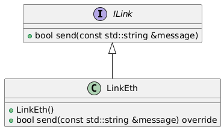

# Component *LinkEth*
This repo consists of component *LinkEth*. It is a part of example application *[broker](https://github.com/slawomir-niespodziany/diff_broker)* which demonstrates the use of *[diff](https://github.com/slawomir-niespodziany/diff)* framework. 

## Description
*LinkEth* is a mock Ethernet communication link. It implements *ILink* interface to accept messages for sending. 

<p align="center"><a href="include/LinkEth.h"></a></p>

## Prerequisites
The example has been prepared and tested on Ubuntu 22.04 and Ubuntu 24.04. That being said, you only need *gcc* and *cmake* to build and install this component. The recent versions (incl. *cmake 4.0.1*) can be downloaded using following commands. 
```
sudo apt -y install build-essential
sudo snap install cmake --classic
```

## Build, Installation, Testing
*LinkEth* component requires *[ilink](https://github.com/slawomir-niespodziany/diff_broker_ilink)* interface to be available in CMake registry. Please refer to its repo for installation guide.

#### Install & test by script
Run the following command from component directory to build, install and test it.
```
./build.sh
```

#### Build & install by hand
Run the following commands from component directory to build (incl. tests) and install it manually. 
```
cmake -Bbuild -DCMAKE_EXPORT_PACKAGE_REGISTRY=ON
cmake --build build
```

#### Test by hand
Tests are run in isolation from other components. Execute the following command from component directory to run them.
```
ctest --test-dir build/test
```
